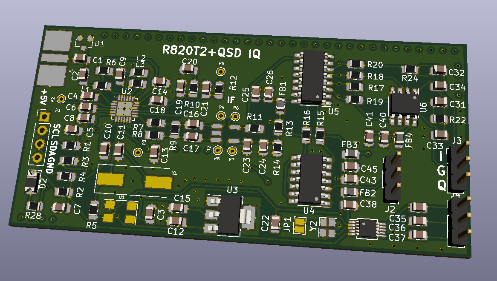

Proyecto 'breakout' de un R820T2 más un QSD para obtener salida IQ directamente a la tarjeta de sonido del PC. La idea es experimentar con el R820T2 y un QSD cuya frecuencia de refencia es 4X a la de demodulación, generada por un Si5351. 

El proyecto contiene:

- Carpeta KICAD: esquemas y PCB directos para generar gerbers.

- Carpeta r820t2: código Arduino para controla el R820T2 y Si5351.

+ Existe un modo consola de comandos serial para controlar los registros del R820T2 directamente y experiemntar.

+ Modo CAT para controlar la frecuencia de sintonía a través de OMNIRIG y el HDSDR por ejemplo.

Los principales aspectos del diseño son:

- El microcontrolador que usemos debe ser 3.3V. 
- El código inicia el R820T2 mediante protocolo I2C. El led, pin 13, y la salida por el puerto serie nos dan indicación del proceso de inicio.
- La parte LOOP consiste en una librería CAT para controlar la frecuencia de sintonía mediante el PC, como por ejemplo el OMNIRIG y el HDSDR.

El principio de hardware es:

- La salida del R820T2 se fija en 5 MHz. El tuner hace un proceso de mezcla de la entrada RF, y la frecuencia de sintonía aparecerá en su salida en esos 5 MHz.
- Se emplea la salida CLKOUT del R820T2, como entrada para un Si5351. Lo ideal es usar un cristal de 25 Mhz en el R820T2.
- Se programa la salida del Si5351 CLK2 a 20 Mhz, que será la entrada del demodulador QSD. Esto realmente es un 'exceso' pero la idea es experimentar con el Si5351 también. Bastaría con instalar un TCXO de 20Mhz al R820T2 para tener exactamente la frecuencia necesaria de demodulación en el QSD, esto es 5 Mhz. Este TCXO sería precisamente el U1. 
- La conversión tiene lugar justo en esos 20MHz/4, esto es, 5 Mhz, justo la salida del R820T2.
- La salida IQ es pues en banda base y directamente aplicable a la tarjeta de sonido del PC. Es recomendable ajustar la entrada a 192 Khz para poder demodular WFM correctamente.
- Con cualquier software que soporte la tarjeta de sonido como entrada, SDR#, o HDSDR, por ejemplo, nos permitirá ver el espectro y demodular la señal resultante.

Modelo 3D de la placa PCB mediante KICAD:

El proyecto está basado en fuentes como:

Driver del kernel linux del R820T2 ofrecido bajo licencia GPL.
Datasheet del R820T2.
Breakout y fuentes del proyecto del R820T2 de Eric Brombaugh https://github.com/emeb/r820t2/. Licencia MIT.

Esteban EA8DGL estebanjbs < at > gmail.com
